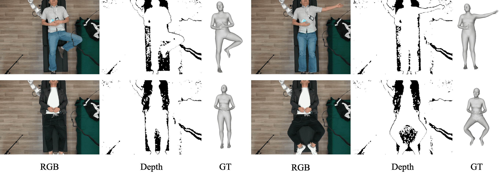

# RGB-D Human Lying Pose Dataset for Anatomy Avatar Reconstruction

## Inputs: RGB-D images
1. **SLP Dataset**: https://github.com/ostadabbas/SLP-Dataset-and-Code  
Download SLP dataset from SLP page at ACLab website, unzip.
2. **Collected Dataset**: We colleted an RGB-D lying pose dataset for robot-assisted medical scanning under the view of the eye-to-hand depth camera.  

Comming soon.

## Annotations: SMPL parameters
1. **SLP Dataset**: https://github.com/pgrady3/SLP-3Dfits  
The SMPL annotations of SLP Dataset can be obtained from the mentioned link, and the twist angle annotations are calculated by LBS (see `cal_twist.py`).
2. **Collected Dataset**: SMPLify-3D, comming soon
